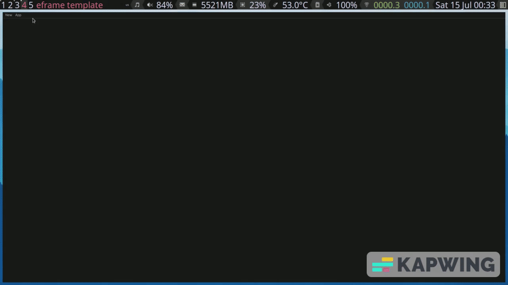
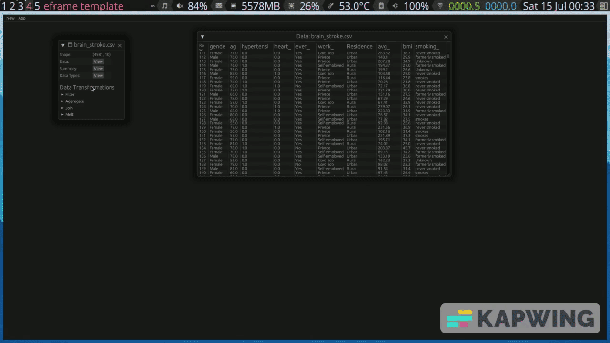
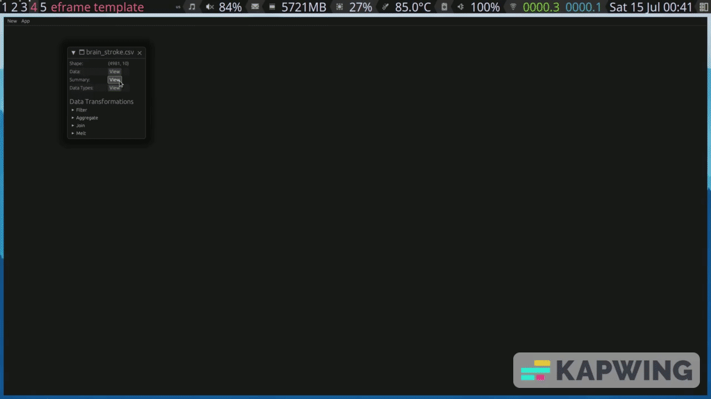
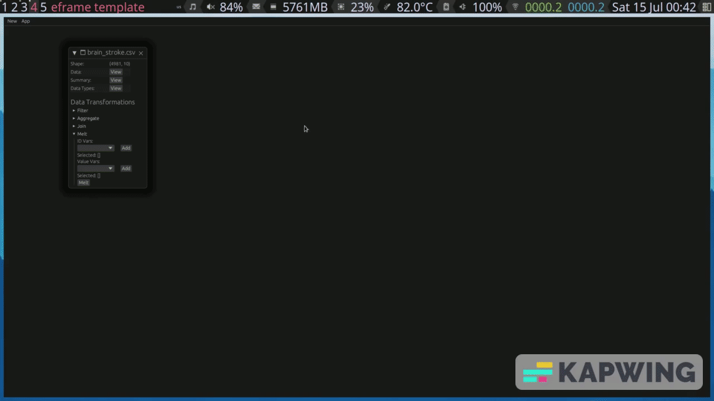
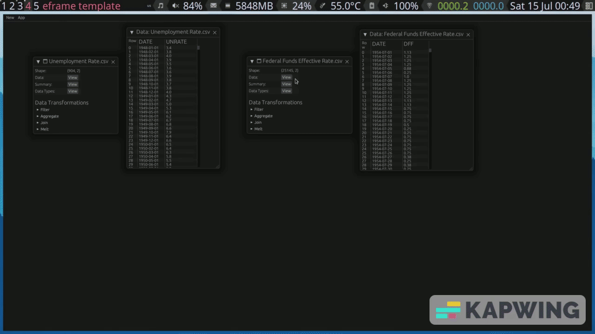

# Polars-GUI

A gui interface for [polars-rs](https://www.pola.rs/) Dataframes. This project
is inspired in the python [PandasGUI](https://pypi.org/project/pandasgui/)
library as a way to load Dataframes and perform basic data analysis and 
transformations.

PolarsGUI uses the [egui](https://github.com/emilk/egui) and
[eframe](https://github.com/emilk/egui/tree/master/crates/eframe) frameworks
for UI rendering.

## Current features

* Load multiple files as Polars DataFrame (currently supports csv data only).
* Filter data
* Aggregate functions
* Reshape data
* Merge/Join datasets

## Installation
```
git clone https://github.com/fedecarles/polars-gui
cd polars-gui
cargo build // build locally
./target/release/polarsgui // run program
```

The current version also compiles on wasm. To run on the browser (that supports wasm) run:
```
trunk serve
```


## Usage
### Data View and Description

### Filter DataFrame

### Aggregate

### Melt DataFrame

### Merge DataFrame

